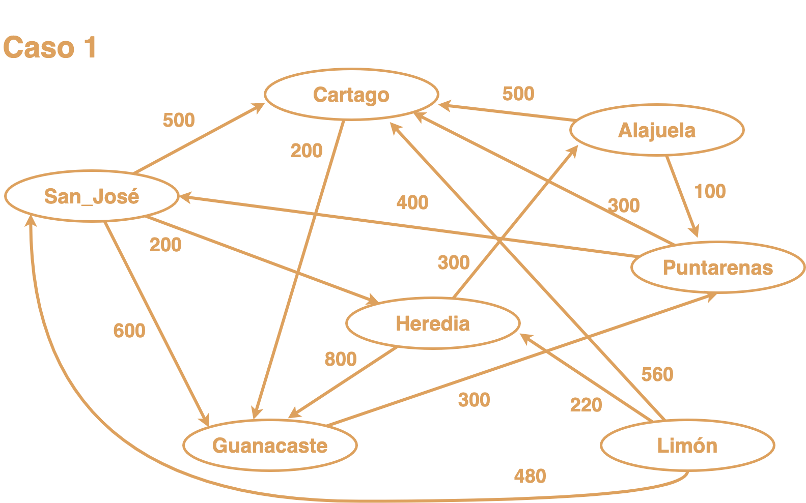
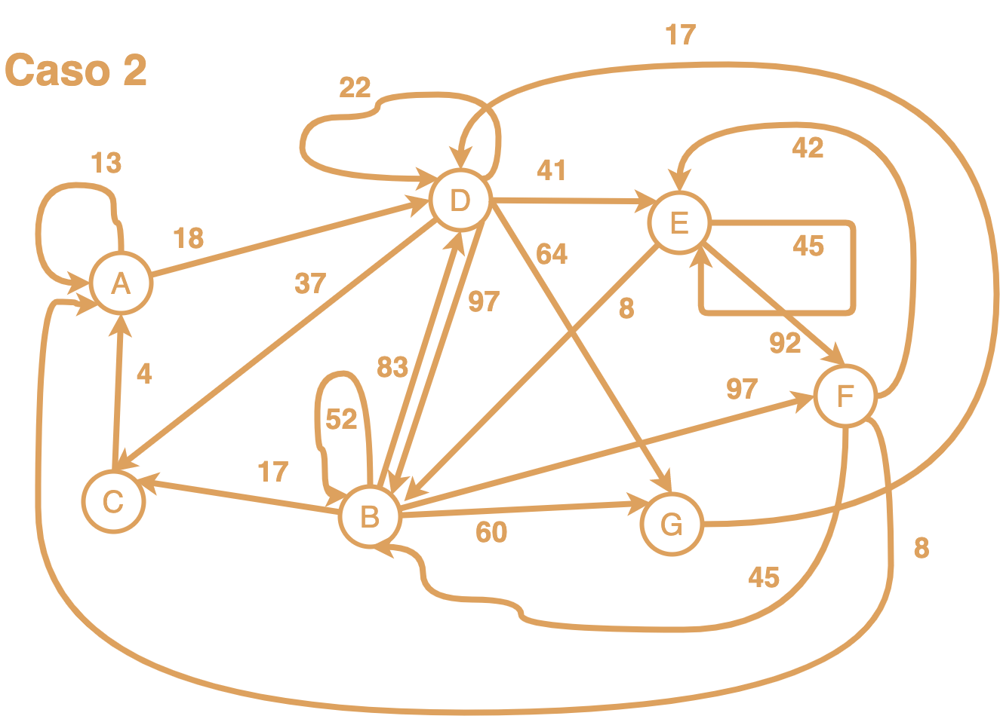
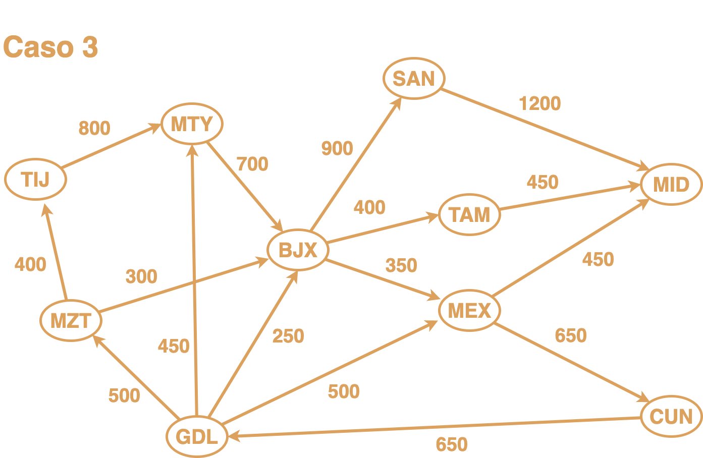
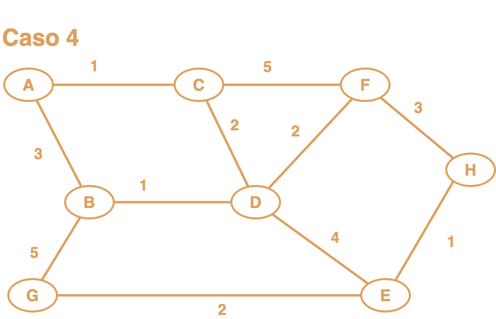

# Grado enlace múltiple

### Fuentes utilizadas
serie de videos de [Emmanuel L G](https://www.youtube.com/channel/UCgSqjL_eeleuFjuGvOLg71A) relacionados con Grafo dinámico en C++

* [1 Inicializa, Vacio y Tamaño](https://www.youtube.com/watch?v=fVQejmEx744&list=UUgSqjL_eeleuFjuGvOLg71A&index=9)
* [2 Inserta Vertice e Inserta arista](https://www.youtube.com/watch?v=1afOoqT3WUI&list=UUgSqjL_eeleuFjuGvOLg71A&index=8)
* [3 Lista de adyacencia, Eliminar arista y Anular](https://www.youtube.com/watch?v=v9Hvx6fvfGo&list=UUgSqjL_eeleuFjuGvOLg71A&index=7)
* [4 Eliminar vertice](https://www.youtube.com/watch?v=QRRaRNaVVqA&list=UUgSqjL_eeleuFjuGvOLg71A&index=3)
* [5 Recorrido en anchura](https://www.youtube.com/watch?v=lbz9gAmzovk&list=UUgSqjL_eeleuFjuGvOLg71A&index=4)
* [6 Recorrido en profundidad](https://www.youtube.com/watch?v=sKU5eLhBGrI&list=UUgSqjL_eeleuFjuGvOLg71A&index=6)
* [7 Primero en anchura](https://www.youtube.com/watch?v=Hi9JXydttU4&list=UUgSqjL_eeleuFjuGvOLg71A&index=2)
* [8 Primero en profundidad](https://www.youtube.com/watch?v=G5XjgCm0EYw&list=UUgSqjL_eeleuFjuGvOLg71A&index=1)
* [9 Primero el mejor](https://www.youtube.com/watch?v=lqCxp7J5Pgk&list=UUgSqjL_eeleuFjuGvOLg71A&index=5)

### Casos utilizados

#### Nota
El método de Dijkstra, resuelve solamente grafos dirigidos.